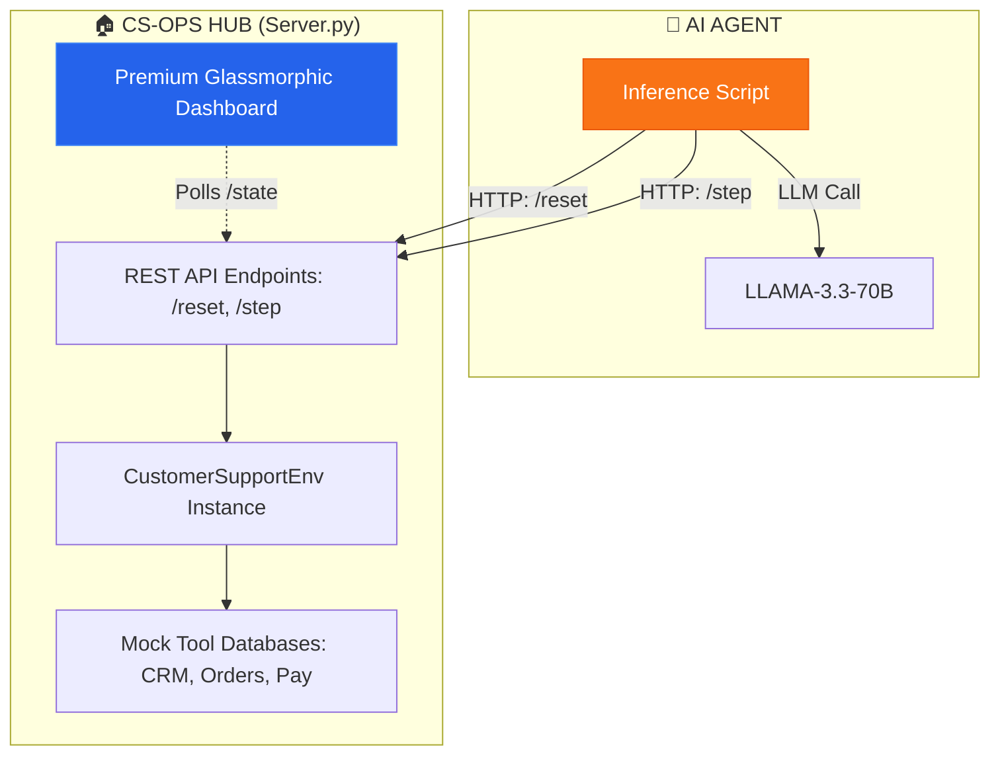

# 🎧 OpenEnv: Customer Support Operations (CS-Ops)

[](https://openenv.ai)
[](https://opensource.org/licenses/MIT)
[](https://www.scaler.com/school-of-technology/meta-pytorch-hackathon/)

A **production-grade OpenEnv environment** simulating high-stakes customer support workflows. An AI agent manages complex tickets, uses simulated tools (CRM, SAP, Payments), and is evaluated with **dense step-level rewards**, **deterministic grading**, and an **adaptive curriculum system**.

---

## 🏗️ Architecture & Interaction

The project follows a modular **Server-Client architecture**, enabling real-time visualization of the AI's "thought process" and actions.



### 🧠 The Mission
The agent must resolve a diverse set of customer tickets while maintaining a high **Progress-to-Resolution (P2R)** score, ensuring correct tool usage, and managing customer sentiment.

---

## 🌟 Technical Innovation

| Innovation | Description |
|---|---|
| **Adaptive Curriculum** | Difficulty automatically shifts (`EASY` → `EXPERT`) based on a 3-episode rolling average reward. |
| **Dense Step Rewards** | Real-time feedback across 5 dimensions: Action Relevance, Correctness, Tone, Tool Use, and Progress. |
| **Unified Visualization** | A premium glassmorphic UI that provides high-fidelity insights into the agent's internal state. |
| **Deterministic Grading** | LLM-as-a-Judge grading with ground-truth alignment for unbiased evaluation. |

---

## 📁 Project Structure

```
openenv_project/
├── env/                     # Core Logic (The Environment)
│   ├── environment.py       # Main reset/step/state hub
│   ├── reward.py            # Dense reward design
│   ├── curriculum.py        # Difficulty progression
│   ├── tools.py             # Mock Tool APIs (CRM, Orders)
│   └── tasks/               # 8 Production-grade Task scenarios
├── static/                  # Dashboard Assets
├── server.py                # Environment Host (REST API)
├── inference.py             # Agent Logic (Client)
├── setup.sh                 # [NEW] One-click environment setup
├── run_demo.sh              # [NEW] Unified launcher
└── README.md
```

---

## 🚀 One-Click Ready (Hackathon Submission)

We've made it trivial to evaluate the project.

### 1. Setup & Launch
```bash
# Setup the environment and install dependencies
bash setup.sh

# Export your API Key
export GROQ_API_KEY=your_key_here

# Launch the visualizer AND the agent simultaneously
bash run_demo.sh
```

👉 **View Live Dashboard:** Open [http://localhost:7860](http://localhost:7860) to watch the agent solve tickets in real-time.

---

## 👁️ Visual Results (Gallery)

The **Premium Visualizer** provides a deep dive into the agent's operations:
*   **Inference Logic Stream**: Staggered feed of agent actions and step scores.
*   **Customer Matrix**: Real-time sentiment, account tier, and priority tracking.
*   **Episode Summary**: Automated performance reports at the end of every task.

---

## ⚙️ Environment Variables

| Variable | Default | Description |
|---|---|---|
| `API_BASE_URL` | `https://api.groq.com/openai/v1` | LLM API endpoint |
| `MODEL_NAME` | `llama-3.3-70b-versatile` | Model identifier |
| `ENV_SEED` | `42` | Reproducibility seed |

---

Developed for the **Scaler Meta PyTorch Hackathon — OpenEnv Assessment**.
tructural validation of all actions
- **Anti-cheat grading**: Multiplier penalizes gaming patterns (e.g., immediate close, no tool use, too-short episodes)
- **Hallucination resistance**: Gold-standard keyword matching for replies

---
